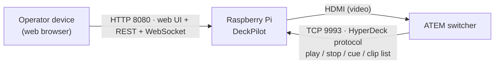
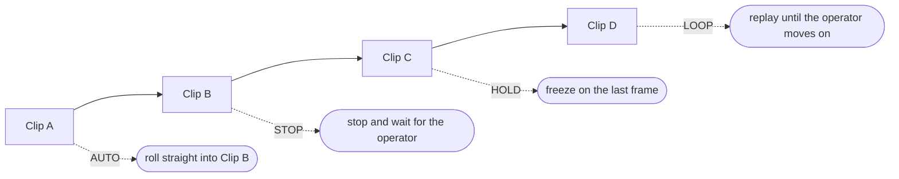
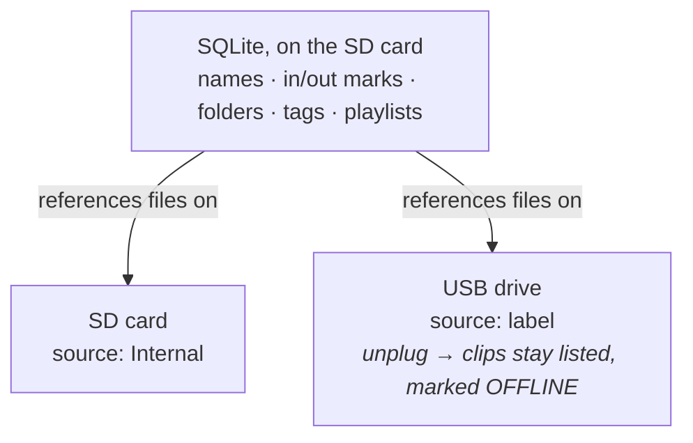
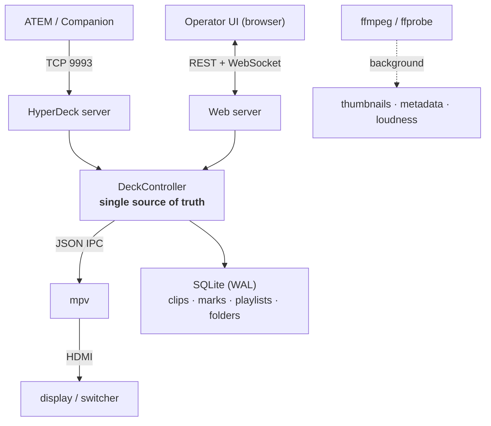

# DeckPilot

A Raspberry Pi that plays clips into your ATEM and answers like a Blackmagic HyperDeck.

You connect the Pi's HDMI output to a switcher input, point ATEM Software Control (or Bitfocus Companion) at it over the network, and from then on the switcher drives it as if it were a real HyperDeck. The operator, meanwhile, gets a dark broadcast-style web page to manage clips, build rundowns, set trim points, and fire playback with a single key.

No build step, no database server. One Python process, one SQLite file. The reference hardware is a Raspberry Pi 3B+.

```bash
curl -fsSL https://raw.githubusercontent.com/JulesMellot/deckpilot/main/scripts/bootstrap.sh | bash
```

That one command is the whole install on a Pi. It detects the platform, installs `mpv` and `ffmpeg`, sets up Python, registers a systemd service, and adds a boot screen on the HDMI output that shows the deck's IP address. Open `http://<pi-ip>:8080` and you are running.

> **Status:** alpha / early beta. It already works for real validation, but it is still being hardened. Protocol traces from real ATEM hardware are the single most useful thing you can contribute — see [Contributing](#contributing).

---

## How the pieces connect

A HyperDeck does one job in a live show: play the right clip the moment the director calls for it. DeckPilot does that job on cheap hardware. Two things plug into the Pi — the switcher (video out + control in) and the operator (a browser):



The switcher and the operator can both act at the same time. They are two front doors into the same playback engine, so the on-air state stays consistent no matter who pressed what.

---

## What the operator gets

DeckPilot speaks enough HyperDeck protocol to satisfy an ATEM, and then adds the things a solo operator actually reaches for during a show.

### Firing clips

`1`–`9` fire the first nine clips instantly. Hold `Shift` to cue instead of fire. `Space` toggles play/pause, `Esc` stops, `Enter` cuts to black. The same nine pads sit on screen and light up — **red when on air, green when cued** — so a touch screen works as well as a keyboard.

### A rundown that knows what comes next

A playlist is more than an ordered list. Each item carries its own **end behavior**, which decides what happens when that clip reaches its out point:



A NEXT bar shows what is coming and counts down to the change point. You can reorder items while the show is live — the engine re-reads the rundown at every boundary, so the output never flashes black between decisions.

### Trimming without an editor

Set in and out marks from the live transport, or while scrubbing the browser preview. Playback then starts at the in mark and stops (or advances) at the out mark. The big remaining timer counts down to *your* out point and turns amber, then red, as it approaches.

### Hard to take off air by accident

- **Safe mode** arms a live action for a short window before it actually fires, so a stray click does not cut you off.
- A **standby slate** (deck name + network address) holds the output when idle, instead of a black screen.
- If the player process dies mid-show, DeckPilot relaunches `mpv` and re-seeks to where it was.

### A library that fills itself

Drop files in any of three ways and they appear in the library on their own:

- drag-and-drop upload in the browser,
- copy over SMB or USB into the clips folder,
- paste a network URL with **ADD LINK** (`http`, `https`, HLS, RTSP, RTMP) — mpv plays the stream like any clip; a live or slow source simply becomes an open-ended clip.

A **watch folder** waits until a file's copy has finished, then generates the thumbnail, probes metadata, and computes audio levels in the background — always at lower priority than playback. Supported media: video (`.mp4`, `.mov`, `.mkv`, `.webm`) and stills (`.png`, `.jpg`, `.webp`, `.gif`, with a per-still duration). Folders, tags, and search are built in.

### SD card and USB drives, side by side

Full-resolution clips fill an SD card quickly, so DeckPilot reads from the internal card **and** any plugged-in USB drive at the same time. The key idea: the library metadata lives in one SQLite file on the SD card, and it only *references* the media files on disk.



Because of that split, unplugging a drive does not lose anything: its clips stay in the library marked **OFFLINE**, with names, marks, folders and playlist references intact, and they come back when the drive returns. Firing an offline clip is blocked rather than failing silently.

On a Pi appliance the installer wires up **USB auto-mount** (a udev rule + systemd unit) so a drive plugged in *after boot* mounts under `/media/deckpilot/<label>` — including NTFS and exFAT — even on headless Raspberry Pi OS Lite, which has no desktop automounter. Or use **Settings → Media Storage → Rescan**, which also lists every drive and its free space. The **STORAGE** tile on the health panel shows free / total of the internal disk.

### Independent video and audio outputs

Video and audio are routed separately, so you can keep the picture on HDMI to the switcher while the sound leaves through the analog jack or a USB interface. **Settings → Audio Output** probes the Pi's sound cards and collapses ALSA's raw PCM list down to plain choices: **Auto / HDMI / Jack / USB** (numbered when there are two of a kind). The change applies live and is saved to `config.json`, so it survives a reboot. Because the Pi's headphone jack is quiet by design, DeckPilot lifts the card's ALSA mixer to full level at startup so the on-screen volume slider works from a real signal.

### Numbers you can trust

Live timecode with mark-aware countdown, a real VU meter driven by precomputed loudness envelopes (so it costs no CPU during playback), CPU temperature / load / RAM on the health panel, and the HyperDeck protocol log streaming live in green-on-black.

---

## How it compares

I built DeckPilot after running live shows off the alternatives, and each one taught me what I was actually missing.

A **real HyperDeck** does the job — it just costs more than the rest of a small kit put together, and most of that price pays for recording and multi-slot features I never touched. I only needed "play this clip when the director says go."

The **DIY HyperDeck emulators** on GitHub got me on air. They are honest about being prototypes, and it shows: VLC- or OMX-based scripts that answer port `9993` with partial protocol coverage, no in/out marks, no rundown, and barely any operator interface. The first time the ATEM strayed off the happy path, the connection desynced.

**OBS** is a great production suite, but it is the wrong shape for this. It is heavy on a Pi, the ATEM can't drive it as a deck (no HyperDeck protocol at all), and "fire clip N on cue" is buried under a tool built for compositing whole scenes.

DeckPilot is the deck I wanted those projects to be: the protocol audited against the spec so the ATEM treats it as real hardware, plus the operator layer a live show needs — fire pads, a NEXT countdown, trim marks, end-of-clip behaviors, safe mode, and a library that survives a USB drive being unplugged mid-show.

| | Real HyperDeck | DIY emulators | OBS | DeckPilot |
|---|:---:|:---:|:---:|:---:|
| Cost | hardware $$$ | free | free | free (+ a Pi) |
| Runs on a Pi 3B+ | — | varies | heavy | by design |
| ATEM-native HyperDeck protocol | yes | partial | no | yes, spec-audited |
| In/out marks & rundown | yes | rarely | manual | yes |
| Operator UI (pads, NEXT, panic) | hardware panel | minimal | not for this | yes |
| USB offline-safe library | yes | no | — | yes |
| Maturity | production | prototype | production | alpha, hardening |

Credit where it's due — the DIY emulators ([`mochouinard/python-hyperdeck-server`](https://github.com/mochouinard/python-hyperdeck-server), [`superlou/pideck`](https://github.com/superlou/pideck), and others) are what showed me this was even possible on a Pi.

---

## What the ATEM sees: the HyperDeck protocol

DeckPilot implements the [Blackmagic HyperDeck Ethernet Protocol](https://documents.blackmagicdesign.com/DeveloperManuals/HyperDeckEthernetProtocol.pdf) — plain text over TCP `9993`, announced as protocol `1.11`. It has been checked line by line against the official spec: response codes, parameter names, and message formats all match.

**The wire format, as a real deck speaks it:**

- on connect: `500 connection info:` with the protocol version and model
- success: `200 ok`; informational replies in the `2xx` range (`204 device info:`, `205 clips info:`, `208 transport info:`, `209 notify:`, `210 remote info:`, `211 configuration:`)
- failures use the official `1xx` codes: `100 syntax error`, `102 invalid value`, `107 timeline empty`, `111 remote control disabled`, `112 clip not found`, `150 invalid state`
- asynchronous notifications use the `5xx` range (`508 transport info:`, `502 slot info:`, `510 remote info:`) and are **off by default per the spec** — a controller opts in with `notify:`

**Commands implemented** — the set ATEM and Companion actually use:

| Group     | Commands |
|-----------|----------|
| Identity  | `device info` (slot count, software version), `configuration`, `ping`, `help`, `quit` |
| Clips     | `clips get` (spec format `id: name start duration`), `clips add` by id or name, `clips clear` |
| Transport | `play` (`speed: 10–200`, `loop`, `single clip`), `stop`, `transport info` (incl. `single clip` and `loop` flags) |
| Cueing    | `goto: clip id: N`, relative `goto: clip id: +1/-1`, `goto: clip: start/end`, `goto: timecode:` (absolute and relative), `playrange set/clear` |
| Sessions  | `notify` (query + set, per-connection), `remote` / `remote info`, `preview` |
| Slots     | `slot info`, `slot select` (one virtual slot) |

**Where it honestly differs from a real deck** — DeckPilot is playout-only:

- `record`, disk formatting, and multi-slot commands are not implemented. A controller that asks for them gets a clean `100` / `102` failure rather than a hang.
- Clip start timecodes are reported as `00:00:00:00`, because files have no embedded timecode track.
- Reverse playback and speeds above 2× return `102 invalid value`. The Pi's decoder cannot honor them, and reporting a speed it cannot deliver would desync the switcher's UI.

The deck's network address is shown in the web UI so ATEM setup is copy-paste, and the protocol log streams live in the operator interface.

---

## How it works inside

DeckPilot runs as a single Python process with three cooperating parts and one shared playback controller in the middle:



State flows one way. The web UI and the HyperDeck server both call into the **one** `DeckController`. The controller updates shared state, drives `mpv` over a JSON IPC socket, and pushes incremental updates to every connected browser over WebSocket. `ffmpeg` / `ffprobe` do the heavy media work in the background so playback always keeps priority.

### Why a Raspberry Pi

I target the Raspberry Pi on purpose, and specifically the cheaper end of it. The goal is a deck that stays rock-solid on one of the least expensive SBCs on the market, so the whole thing lands at a price that actually makes sense next to what it replaces.

Pi 4 and Pi 5 prices have climbed to a point that stopped being reasonable, and the competing boards followed. So instead of chasing the fastest hardware, I push to get as much as possible out of the smallest — a Pi 3B+ with 1 GB of RAM. If it runs well there, it runs well everywhere, and nobody has to buy a board that costs more than the rest of their kit.

The flip side is the nice part: the optimization is for the floor, not a ceiling. Put DeckPilot on more powerful hardware and it simply does more — 4K playback, HDR, an NDI signal, even recording become realistic on a Pi 5 or a small x86 box. The cheap board is the baseline I refuse to break, not the limit.

### Built lean, on purpose

The reference target is a Raspberry Pi 3B+ with 1 GB of RAM, and the design reflects that:

- **No work in steady state.** Once a clip is playing, DeckPilot does not touch SQLite (in-memory caches, invalidated on write) and does not fork processes.
- **No needless broadcasts.** A WebSocket update goes out only when state actually changed, and one JSON encode serves every browser.
- **Kind to SD cards.** SQLite runs in WAL mode and HTTP access logs are off, so the card sees far fewer writes.
- **Bounded memory.** mpv's demuxer cache is capped for 1 GB boards; imports use single-frame thumbnail extraction with a capped worker pool, so playout keeps headroom.
- **No frontend framework.** The UI is vanilla HTML / CSS / JS with DOM reuse and list virtualization — no build step.

**Stack:** Python 3.9+ · FastAPI + Uvicorn · asyncio TCP · SQLite · mpv (JSON IPC) · ffmpeg.

---

## Install

### Linux / macOS (recommended)

```bash
curl -fsSL https://raw.githubusercontent.com/JulesMellot/deckpilot/main/scripts/bootstrap.sh | bash
```

Run it from your normal user account — do **not** `sudo su` into a root shell first. On a Pi the bootstrap also installs the systemd service, the HDMI boot-info screen, and a small privileged helper that lets web-triggered updates reboot the Pi when an update touches appliance-level components.

### Windows (experimental)

```powershell
irm https://raw.githubusercontent.com/JulesMellot/deckpilot/main/scripts/bootstrap.ps1 | iex
```

The mpv IPC layer uses named pipes on Windows. It is wired up but not yet validated on real hardware.

### Manual

```bash
git clone https://github.com/JulesMellot/deckpilot.git && cd deckpilot
python3 -m venv .venv && source .venv/bin/activate
pip install -r requirements.txt
python3 -m app.main
```

The web UI is then at <http://127.0.0.1:8080>. Configuration lives in `config.json` (copy `config.json.example` to start). A few environment variables override it:

| Variable | Purpose |
|----------|---------|
| `PIDECK_HTTP_PORT` / `PIDECK_HYPERDECK_PORT` | Change the web / protocol ports |
| `PIDECK_CONFIG` | Point to a custom `config.json` |
| `PIDECK_WATCH_FOLDER_SECONDS` | Watch-folder scan interval (`0` disables it) |
| `PIDECK_DEFAULT_IMAGE_DURATION_SECONDS` | Default playout duration for stills |
| `PIDECK_MEDIA_ENRICHMENT_WORKERS` | Background import workers (default 2) |
| `PIDECK_AUDIO_DEVICE` | Force the audio output (`auto`, or an mpv device name); usually set from Settings → Audio Output |

For the full Raspberry Pi guide — recommended OS image, HDMI modes for each frame rate, systemd commands, and troubleshooting — see [docs/INSTALL.md](docs/INSTALL.md).

### Connect it to an ATEM

1. Connect DeckPilot's HDMI output to an ATEM input.
2. Put the Pi and the ATEM on the same Ethernet network.
3. In ATEM Software Control → HyperDeck tab, add the address shown in DeckPilot's web UI (the Pi's IP, port `9993`).
4. Enable **Auto Roll** if you want the switcher to roll clips on cut.

> The Pi's HDMI output format must match the ATEM project's video standard — the ATEM does not scale HyperDeck sources. See the HDMI mode table in [docs/INSTALL.md](docs/INSTALL.md).

### Test the protocol

A test client ships in `scripts/hyperdeck_test_client.py`. It works against DeckPilot **and against real HyperDecks**, so you can compare the two side by side:

```bash
# spec-conformance suite (read-only)
python3 scripts/hyperdeck_test_client.py <deck-ip> --check

# the same, plus cue / play / stop checks
python3 scripts/hyperdeck_test_client.py <deck-ip> --check --allow-transport

# stream async notifications live
python3 scripts/hyperdeck_test_client.py <deck-ip> --monitor

# interactive REPL with operator-friendly aliases
python3 scripts/hyperdeck_test_client.py <deck-ip>
```

---

## Control surface

Beyond the HyperDeck protocol, DeckPilot exposes a full HTTP + WebSocket API:

- **REST** — `/api/state`, `/api/clips*` (goto, play, marks, rename, loop, folder, tags, duration, levels), `/api/transport/*` (stop, pause, resume, seek, speed), `/api/playlists*` (incl. per-item end behavior and reorder), `/api/system/*` (outputs, video format, audio devices, black, safe mode, update, export, import, backup), `/api/audio/*` (volume, mute), `/api/upload`
- **WebSocket** — `/ws` streams transport, media, playlists, audio, health, safety, and log events incrementally
- **Backup** — one-click JSON export/import of the whole library state (names, folders, marks, tags, playlists), plus a consistent SQLite snapshot download

---

## Roadmap

- **Near term** — real-world ATEM validation, broader protocol coverage, operator UX polish, import diagnostics, first-run docs.
- **Mid term** — multi-display control, Windows runtime validation, structured logging and fault reporting, more protocol test coverage, packaged releases.
- **Exploring** — SRT contribution output via the Pi's hardware H.264 encoder (full-bandwidth NDI was evaluated and ruled out on the 3B+ with its 100 Mbps NIC, but stays a candidate Pi 5 module via GStreamer `ndisink`), richer dashboards, operator profiles / authentication, recording from a capture input.

---

## Contributing

Pull requests are welcome. The project is small and still moving, so the easiest path is to open an issue first if your change is large — that way we can agree on the approach before you write code. Bug fixes, docs, and small features can go straight to a PR.

Testing feedback matters just as much as code. If you run DeckPilot against live hardware, send us protocol traces and your ATEM setup notes — real validation reports are the most useful thing the project needs right now.

Before you push a PR, run the test suite:

```bash
python3 -m unittest discover -s tests
```
